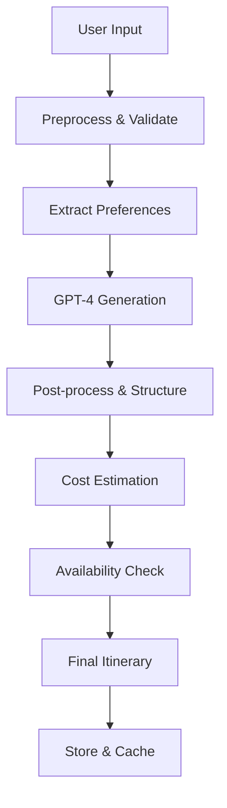
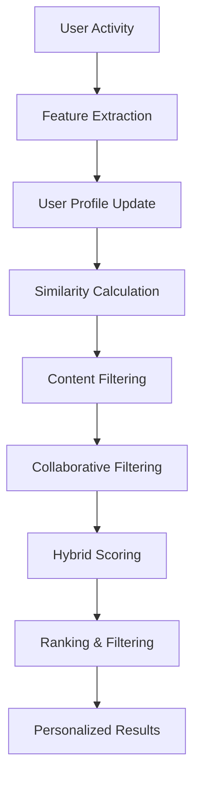

# AI Implementation Guide

## 🤖 AI Components Overview

TravelAI leverages multiple AI technologies to provide intelligent travel planning, personalized recommendations, and enhanced user experiences.

## 🧠 Core AI Models

### 1. Trip Planning AI (GPT-4 Based)
**Purpose**: Generate personalized itineraries from natural language descriptions
**Technology**: OpenAI GPT-4 with custom fine-tuning
**Implementation**: Node.js with OpenAI API

```javascript
// Example implementation
const generateItinerary = async (userPrompt, preferences) => {
  const systemPrompt = `You are a professional travel planner. Create detailed itineraries based on user preferences. Always include:
  - Day-by-day activities with times
  - Estimated costs in USD
  - Practical tips and recommendations
  - Transportation between locations
  - Restaurant suggestions
  
  Format response as structured JSON.`;
  
  const response = await openai.chat.completions.create({
    model: "gpt-4",
    messages: [
      { role: "system", content: systemPrompt },
      { role: "user", content: `${userPrompt}\n\nPreferences: ${JSON.stringify(preferences)}` }
    ],
    temperature: 0.7,
    max_tokens: 4000
  });
  
  return JSON.parse(response.choices[0].message.content);
};
```

### 2. Recommendation Engine
**Purpose**: Personalized destination and activity recommendations
**Technology**: Custom ML model using collaborative filtering + content-based filtering
**Implementation**: Python with TensorFlow/PyTorch, served via REST API

```python
# Recommendation model architecture
class TravelRecommendationModel:
    def __init__(self):
        self.user_embedding = tf.keras.layers.Embedding(num_users, embedding_dim)
        self.item_embedding = tf.keras.layers.Embedding(num_items, embedding_dim)
        self.content_features = tf.keras.layers.Dense(128, activation='relu')
        
    def call(self, inputs):
        user_vec = self.user_embedding(inputs['user_id'])
        item_vec = self.item_embedding(inputs['item_id'])
        content_vec = self.content_features(inputs['content_features'])
        
        # Combine embeddings
        combined = tf.concat([user_vec, item_vec, content_vec], axis=-1)
        output = tf.keras.layers.Dense(1, activation='sigmoid')(combined)
        return output
```

### 3. Price Prediction Model
**Purpose**: Predict flight and hotel price trends
**Technology**: Time series forecasting with LSTM networks
**Implementation**: Python with TensorFlow, scheduled batch processing

```python
# Price prediction model
class PricePredictionModel:
    def __init__(self):
        self.lstm_layers = [
            tf.keras.layers.LSTM(50, return_sequences=True),
            tf.keras.layers.LSTM(50, return_sequences=False),
            tf.keras.layers.Dense(25),
            tf.keras.layers.Dense(1)
        ]
    
    def predict_price_trend(self, historical_data, days_ahead=30):
        # Preprocess data
        scaled_data = self.scaler.transform(historical_data)
        
        # Make predictions
        predictions = self.model.predict(scaled_data)
        
        # Post-process and return
        return self.scaler.inverse_transform(predictions)
```

### 4. Sentiment Analysis Model
**Purpose**: Analyze review sentiment and extract insights
**Technology**: BERT-based model fine-tuned for travel reviews
**Implementation**: Python with Transformers library

```python
from transformers import AutoTokenizer, AutoModelForSequenceClassification

class ReviewSentimentAnalyzer:
    def __init__(self):
        self.tokenizer = AutoTokenizer.from_pretrained('bert-base-uncased')
        self.model = AutoModelForSequenceClassification.from_pretrained(
            'travel-sentiment-bert'
        )
    
    def analyze_review(self, review_text):
        inputs = self.tokenizer(review_text, return_tensors='pt', truncation=True)
        outputs = self.model(**inputs)
        
        sentiment_scores = torch.softmax(outputs.logits, dim=-1)
        return {
            'positive': sentiment_scores[0][1].item(),
            'negative': sentiment_scores[0][0].item(),
            'aspects': self.extract_aspects(review_text)
        }
```

### 5. Image Recognition Model
**Purpose**: Identify destinations and landmarks from user photos
**Technology**: Computer Vision with ResNet/EfficientNet
**Implementation**: Python with PyTorch, deployed on AWS Lambda

```python
class DestinationImageClassifier:
    def __init__(self):
        self.model = torchvision.models.efficientnet_b0(pretrained=False)
        self.model.classifier = nn.Linear(1280, num_destinations)
        self.model.load_state_dict(torch.load('destination_classifier.pth'))
        
    def classify_destination(self, image_path):
        image = self.preprocess_image(image_path)
        with torch.no_grad():
            outputs = self.model(image)
            probabilities = torch.softmax(outputs, dim=1)
            
        top_destinations = torch.topk(probabilities, k=5)
        return self.format_results(top_destinations)
```

## 🔄 AI Workflow Integration

### 1. Itinerary Generation Flow


### 2. Recommendation Pipeline


## 📊 AI Data Requirements

### Training Data Sources
1. **User Interaction Data**
   - Search queries and results
   - Booking patterns
   - Click-through rates
   - Time spent on pages

2. **Content Data**
   - Destination descriptions
   - Hotel/flight features
   - Review text and ratings
   - Image data with labels

3. **External Data**
   - Weather patterns
   - Event calendars
   - Price histories
   - Social media trends

### Data Pipeline
```javascript
// Data collection service
class AIDataCollector {
  async collectUserInteraction(userId, action, data) {
    const interaction = {
      userId,
      action, // search, view, book, review
      data,
      timestamp: new Date(),
      sessionId: this.getSessionId(),
      context: this.getContext()
    };
    
    await this.storeInteraction(interaction);
    await this.updateUserProfile(userId, interaction);
    await this.triggerRetraining(interaction);
  }
  
  async preprocessForTraining() {
    // Clean and prepare data for model training
    const rawData = await this.getRawInteractions();
    const cleanedData = this.cleanData(rawData);
    const features = this.extractFeatures(cleanedData);
    
    return this.formatForModel(features);
  }
}
```

## 🚀 AI Service Architecture

### Microservices Design
```
AI Gateway (Node.js)
├── Itinerary Service (Python/FastAPI)
├── Recommendation Service (Python/FastAPI)
├── Price Prediction Service (Python/FastAPI)
├── Sentiment Analysis Service (Python/FastAPI)
└── Image Recognition Service (Python/FastAPI)
```

### API Integration
```javascript
// AI Gateway Service
class AIGateway {
  constructor() {
    this.services = {
      itinerary: new ItineraryService(),
      recommendations: new RecommendationService(),
      pricing: new PricePredictionService(),
      sentiment: new SentimentService(),
      vision: new ImageRecognitionService()
    };
  }
  
  async generateItinerary(prompt, preferences) {
    // Validate input
    const validation = await this.validateInput(prompt, preferences);
    if (!validation.valid) throw new Error(validation.error);
    
    // Generate itinerary
    const itinerary = await this.services.itinerary.generate(prompt, preferences);
    
    // Enhance with recommendations
    const enhanced = await this.services.recommendations.enhance(itinerary);
    
    // Add price predictions
    const withPricing = await this.services.pricing.addPredictions(enhanced);
    
    return withPricing;
  }
}
```

## 📈 Model Training & Deployment

### Training Pipeline
```python
# Model training orchestrator
class ModelTrainer:
    def __init__(self):
        self.data_loader = DataLoader()
        self.model_registry = ModelRegistry()
        
    async def train_recommendation_model(self):
        # Load and prepare data
        training_data = await self.data_loader.get_training_data()
        train_set, val_set = self.split_data(training_data)
        
        # Initialize model
        model = TravelRecommendationModel()
        
        # Train model
        history = model.fit(
            train_set,
            validation_data=val_set,
            epochs=100,
            callbacks=[
                EarlyStopping(patience=10),
                ModelCheckpoint('best_model.h5')
            ]
        )
        
        # Evaluate and register
        metrics = self.evaluate_model(model, val_set)
        if metrics['accuracy'] > 0.85:
            await self.model_registry.register_model(model, metrics)
            
    def schedule_retraining(self):
        # Schedule periodic retraining
        scheduler.add_job(
            self.train_recommendation_model,
            'cron',
            hour=2,  # Run at 2 AM daily
            minute=0
        )
```

### Model Deployment
```yaml
# Kubernetes deployment for AI services
apiVersion: apps/v1
kind: Deployment
metadata:
  name: ai-recommendation-service
spec:
  replicas: 3
  selector:
    matchLabels:
      app: ai-recommendation
  template:
    metadata:
      labels:
        app: ai-recommendation
    spec:
      containers:
      - name: recommendation-service
        image: travelai/recommendation-service:latest
        ports:
        - containerPort: 8000
        env:
        - name: MODEL_PATH
          value: "/models/recommendation_v2.pkl"
        - name: REDIS_URL
          value: "redis://redis-service:6379"
        resources:
          requests:
            memory: "2Gi"
            cpu: "1000m"
          limits:
            memory: "4Gi"
            cpu: "2000m"
```

## 🔧 AI Configuration

### Environment Variables
```bash
# OpenAI Configuration
OPENAI_API_KEY=sk-...
OPENAI_MODEL=gpt-4
OPENAI_MAX_TOKENS=4000

# Model Serving
MODEL_REGISTRY_URL=https://models.travelai.com
RECOMMENDATION_MODEL_VERSION=v2.1
PRICE_PREDICTION_MODEL_VERSION=v1.3

# Performance
AI_CACHE_TTL=3600
AI_BATCH_SIZE=32
AI_MAX_CONCURRENT_REQUESTS=100

# Monitoring
AI_METRICS_ENABLED=true
AI_LOGGING_LEVEL=INFO
```

### Model Configuration
```json
{
  "models": {
    "itinerary_generation": {
      "provider": "openai",
      "model": "gpt-4",
      "temperature": 0.7,
      "max_tokens": 4000,
      "timeout": 30000
    },
    "recommendations": {
      "algorithm": "hybrid",
      "user_factors": 50,
      "item_factors": 50,
      "regularization": 0.01,
      "learning_rate": 0.001
    },
    "price_prediction": {
      "lookback_days": 90,
      "prediction_horizon": 30,
      "update_frequency": "daily",
      "confidence_threshold": 0.8
    }
  }
}
```

## 📊 AI Monitoring & Analytics

### Performance Metrics
- **Response Time**: < 2 seconds for recommendations
- **Accuracy**: > 85% for price predictions
- **User Satisfaction**: > 4.5/5 for AI-generated itineraries
- **Conversion Rate**: Track bookings from AI recommendations

### A/B Testing Framework
```javascript
class AIExperimentFramework {
  async runExperiment(experimentName, variants, trafficSplit) {
    const experiment = {
      name: experimentName,
      variants,
      trafficSplit,
      startDate: new Date(),
      metrics: ['conversion_rate', 'user_satisfaction', 'response_time']
    };
    
    // Implement traffic splitting
    const userVariant = this.assignVariant(userId, trafficSplit);
    
    // Track experiment results
    await this.trackExperimentMetrics(experiment, userVariant, results);
    
    return results;
  }
}
```