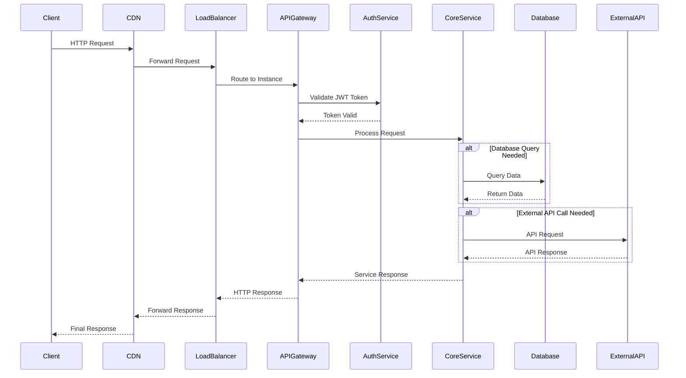
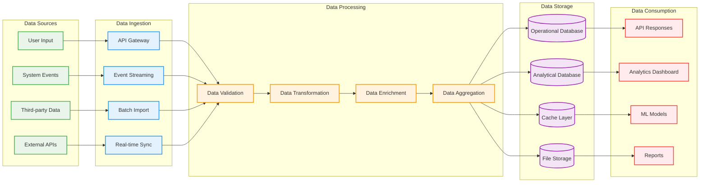

# System Architecture

## 🏗️ High-Level Architecture

```mermaid
graph TB
    subgraph "Client Layer"
        WEB[Web App<br/>React.js]
        MOBILE[Mobile App<br/>React Native]
        API_CLIENT[API Clients<br/>Third-party]
    end
    
    subgraph "CDN & Load Balancer"
        CDN[CloudFlare CDN]
        LB[Load Balancer<br/>AWS ALB]
    end
    
    subgraph "API Gateway"
        GATEWAY[API Gateway<br/>Express.js]
        AUTH[Auth Service<br/>JWT + OAuth]
        RATE[Rate Limiter<br/>Redis]
    end
    
    subgraph "Core Services"
        USER[User Service]
        BOOKING[Booking Service]
        SEARCH[Search Service]
        PAYMENT[Payment Service]
        NOTIFICATION[Notification Service]
    end
    
    subgraph "AI Services"
        AI_GATEWAY[AI Gateway]
        ITINERARY_AI[Itinerary AI<br/>GPT-4]
        RECOMMENDATION[Recommendation<br/>ML Model]
        PRICE_PREDICT[Price Prediction<br/>LSTM]
        SENTIMENT[Sentiment Analysis<br/>BERT]
    end
    
    subgraph "External APIs"
        FLIGHT_API[Flight APIs<br/>Amadeus, Sabre]
        HOTEL_API[Hotel APIs<br/>Booking.com, Expedia]
        PAYMENT_API[Payment APIs<br/>Stripe, PayPal]
        EMAIL_API[Email Service<br/>SendGrid]
        SMS_API[SMS Service<br/>Twilio]
    end
    
    subgraph "Data Layer"
        MONGODB[(MongoDB<br/>Primary DB)]
        REDIS[(Redis<br/>Cache & Sessions)]
        S3[(AWS S3<br/>File Storage)]
        ELASTICSEARCH[(Elasticsearch<br/>Search Index)]
    end
    
    subgraph "Infrastructure"
        MONITORING[Monitoring<br/>DataDog]
        LOGGING[Logging<br/>ELK Stack]
        BACKUP[Backup<br/>AWS Backup]
    end
    
    %% Client connections
    WEB --> CDN
    MOBILE --> CDN
    API_CLIENT --> CDN
    
    %% CDN to Load Balancer
    CDN --> LB
    
    %% Load Balancer to API Gateway
    LB --> GATEWAY
    
    %% API Gateway connections
    GATEWAY --> AUTH
    GATEWAY --> RATE
    GATEWAY --> USER
    GATEWAY --> BOOKING
    GATEWAY --> SEARCH
    GATEWAY --> PAYMENT
    GATEWAY --> NOTIFICATION
    GATEWAY --> AI_GATEWAY
    
    %% AI Services
    AI_GATEWAY --> ITINERARY_AI
    AI_GATEWAY --> RECOMMENDATION
    AI_GATEWAY --> PRICE_PREDICT
    AI_GATEWAY --> SENTIMENT
    
    %% External API connections
    SEARCH --> FLIGHT_API
    SEARCH --> HOTEL_API
    PAYMENT --> PAYMENT_API
    NOTIFICATION --> EMAIL_API
    NOTIFICATION --> SMS_API
    
    %% Data Layer connections
    USER --> MONGODB
    BOOKING --> MONGODB
    SEARCH --> ELASTICSEARCH
    GATEWAY --> REDIS
    RATE --> REDIS
    AI_GATEWAY --> REDIS
    
    %% File storage
    USER --> S3
    BOOKING --> S3
    
    %% Infrastructure
    GATEWAY --> MONITORING
    GATEWAY --> LOGGING
    MONGODB --> BACKUP
    
    %% Styling
    classDef coreService fill:#3B71FE,stroke:#2563EB,stroke-width:2px,color:#fff
    classDef aiService fill:#FFD166,stroke:#F59E0B,stroke-width:2px,color:#000
    classDef externalService fill:#58C27D,stroke:#10B981,stroke-width:2px,color:#fff
    classDef dataService fill:#777E90,stroke:#6B7280,stroke-width:2px,color:#fff
    classDef infraService fill:#FF6B6B,stroke:#EF4444,stroke-width:2px,color:#fff
    
    class USER,BOOKING,SEARCH,PAYMENT,NOTIFICATION coreService
    class AI_GATEWAY,ITINERARY_AI,RECOMMENDATION,PRICE_PREDICT,SENTIMENT aiService
    class FLIGHT_API,HOTEL_API,PAYMENT_API,EMAIL_API,SMS_API externalService
    class MONGODB,REDIS,S3,ELASTICSEARCH dataService
    class MONITORING,LOGGING,BACKUP infraService
```

## 🔄 Request Flow Architecture

```mermaid
sequenceDiagram
    participant Client
    participant CDN
    participant LoadBalancer
    participant APIGateway
    participant AuthService
    participant CoreService
    participant Database
    participant ExternalAPI
    
    Client->>CDN: HTTP Request
    CDN->>LoadBalancer: Forward Request
    LoadBalancer->>APIGateway: Route to Instance
    
    APIGateway->>AuthService: Validate JWT Token
    AuthService-->>APIGateway: Token Valid
    
    APIGateway->>CoreService: Process Request
    
    alt Database Query Needed
        CoreService->>Database: Query Data
        Database-->>CoreService: Return Data
    end
    
    alt External API Call Needed
        CoreService->>ExternalAPI: API Request
        ExternalAPI-->>CoreService: API Response
    end
    
    CoreService-->>APIGateway: Service Response
    APIGateway-->>LoadBalancer: HTTP Response
    LoadBalancer-->>CDN: Forward Response
    CDN-->>Client: Final Response
```

## 🏢 Microservices Architecture

```mermaid
graph TB
    subgraph "Frontend Services"
        WEB_APP[Web Application]
        MOBILE_APP[Mobile Application]
        ADMIN_PANEL[Admin Panel]
    end
    
    subgraph "API Gateway Layer"
        API_GATEWAY[API Gateway]
        AUTH_SERVICE[Authentication Service]
        RATE_LIMITER[Rate Limiting Service]
    end
    
    subgraph "Core Business Services"
        USER_SERVICE[User Management Service]
        BOOKING_SERVICE[Booking Service]
        SEARCH_SERVICE[Search Service]
        PAYMENT_SERVICE[Payment Service]
        NOTIFICATION_SERVICE[Notification Service]
        REVIEW_SERVICE[Review Service]
        CONTENT_SERVICE[Content Management Service]
    end
    
    subgraph "AI & ML Services"
        AI_ORCHESTRATOR[AI Orchestrator]
        ITINERARY_SERVICE[Itinerary Generation Service]
        RECOMMENDATION_SERVICE[Recommendation Service]
        PRICE_PREDICTION_SERVICE[Price Prediction Service]
        SENTIMENT_SERVICE[Sentiment Analysis Service]
        IMAGE_SERVICE[Image Recognition Service]
    end
    
    subgraph "Data Services"
        USER_DB[(User Database)]
        BOOKING_DB[(Booking Database)]
        CONTENT_DB[(Content Database)]
        SEARCH_INDEX[(Search Index)]
        CACHE[(Redis Cache)]
        FILE_STORAGE[(File Storage)]
    end
    
    subgraph "External Integrations"
        FLIGHT_PROVIDERS[Flight Data Providers]
        HOTEL_PROVIDERS[Hotel Data Providers]
        PAYMENT_PROVIDERS[Payment Providers]
        EMAIL_PROVIDER[Email Service Provider]
        SMS_PROVIDER[SMS Service Provider]
    end
    
    subgraph "Infrastructure Services"
        MONITORING[Monitoring & Alerting]
        LOGGING[Centralized Logging]
        CONFIG_SERVICE[Configuration Service]
        SERVICE_DISCOVERY[Service Discovery]
    end
    
    %% Frontend to API Gateway
    WEB_APP --> API_GATEWAY
    MOBILE_APP --> API_GATEWAY
    ADMIN_PANEL --> API_GATEWAY
    
    %% API Gateway to Auth and Rate Limiting
    API_GATEWAY --> AUTH_SERVICE
    API_GATEWAY --> RATE_LIMITER
    
    %% API Gateway to Core Services
    API_GATEWAY --> USER_SERVICE
    API_GATEWAY --> BOOKING_SERVICE
    API_GATEWAY --> SEARCH_SERVICE
    API_GATEWAY --> PAYMENT_SERVICE
    API_GATEWAY --> NOTIFICATION_SERVICE
    API_GATEWAY --> REVIEW_SERVICE
    API_GATEWAY --> CONTENT_SERVICE
    
    %% API Gateway to AI Services
    API_GATEWAY --> AI_ORCHESTRATOR
    AI_ORCHESTRATOR --> ITINERARY_SERVICE
    AI_ORCHESTRATOR --> RECOMMENDATION_SERVICE
    AI_ORCHESTRATOR --> PRICE_PREDICTION_SERVICE
    AI_ORCHESTRATOR --> SENTIMENT_SERVICE
    AI_ORCHESTRATOR --> IMAGE_SERVICE
    
    %% Services to Databases
    USER_SERVICE --> USER_DB
    BOOKING_SERVICE --> BOOKING_DB
    CONTENT_SERVICE --> CONTENT_DB
    SEARCH_SERVICE --> SEARCH_INDEX
    
    %% Services to Cache
    USER_SERVICE --> CACHE
    BOOKING_SERVICE --> CACHE
    SEARCH_SERVICE --> CACHE
    AI_ORCHESTRATOR --> CACHE
    
    %% Services to File Storage
    USER_SERVICE --> FILE_STORAGE
    CONTENT_SERVICE --> FILE_STORAGE
    
    %% External Integrations
    SEARCH_SERVICE --> FLIGHT_PROVIDERS
    SEARCH_SERVICE --> HOTEL_PROVIDERS
    PAYMENT_SERVICE --> PAYMENT_PROVIDERS
    NOTIFICATION_SERVICE --> EMAIL_PROVIDER
    NOTIFICATION_SERVICE --> SMS_PROVIDER
    
    %% Infrastructure Services
    API_GATEWAY --> MONITORING
    USER_SERVICE --> MONITORING
    BOOKING_SERVICE --> MONITORING
    
    API_GATEWAY --> LOGGING
    USER_SERVICE --> LOGGING
    BOOKING_SERVICE --> LOGGING
    
    API_GATEWAY --> CONFIG_SERVICE
    USER_SERVICE --> CONFIG_SERVICE
    BOOKING_SERVICE --> CONFIG_SERVICE
    
    API_GATEWAY --> SERVICE_DISCOVERY
    USER_SERVICE --> SERVICE_DISCOVERY
    BOOKING_SERVICE --> SERVICE_DISCOVERY
    
    %% Styling
    classDef frontend fill:#E3F2FD,stroke:#1976D2,stroke-width:2px
    classDef gateway fill:#F3E5F5,stroke:#7B1FA2,stroke-width:2px
    classDef core fill:#E8F5E8,stroke:#388E3C,stroke-width:2px
    classDef ai fill:#FFF3E0,stroke:#F57C00,stroke-width:2px
    classDef data fill:#FAFAFA,stroke:#616161,stroke-width:2px
    classDef external fill:#FFEBEE,stroke:#D32F2F,stroke-width:2px
    classDef infra fill:#F1F8E9,stroke:#689F38,stroke-width:2px
    
    class WEB_APP,MOBILE_APP,ADMIN_PANEL frontend
    class API_GATEWAY,AUTH_SERVICE,RATE_LIMITER gateway
    class USER_SERVICE,BOOKING_SERVICE,SEARCH_SERVICE,PAYMENT_SERVICE,NOTIFICATION_SERVICE,REVIEW_SERVICE,CONTENT_SERVICE core
    class AI_ORCHESTRATOR,ITINERARY_SERVICE,RECOMMENDATION_SERVICE,PRICE_PREDICTION_SERVICE,SENTIMENT_SERVICE,IMAGE_SERVICE ai
    class USER_DB,BOOKING_DB,CONTENT_DB,SEARCH_INDEX,CACHE,FILE_STORAGE data
    class FLIGHT_PROVIDERS,HOTEL_PROVIDERS,PAYMENT_PROVIDERS,EMAIL_PROVIDER,SMS_PROVIDER external
    class MONITORING,LOGGING,CONFIG_SERVICE,SERVICE_DISCOVERY infra
```

## 🔐 Security Architecture

```mermaid
graph TB
    subgraph "Security Perimeter"
        WAF[Web Application Firewall]
        DDoS[DDoS Protection]
        CDN_SEC[CDN Security]
    end
    
    subgraph "Authentication & Authorization"
        OAUTH[OAuth 2.0 Provider]
        JWT_SERVICE[JWT Token Service]
        RBAC[Role-Based Access Control]
        MFA[Multi-Factor Authentication]
    end
    
    subgraph "API Security"
        API_KEY[API Key Management]
        RATE_LIMIT[Rate Limiting]
        INPUT_VALIDATION[Input Validation]
        CORS[CORS Policy]
    end
    
    subgraph "Data Security"
        ENCRYPTION[Data Encryption at Rest]
        TLS[TLS/SSL in Transit]
        KEY_MANAGEMENT[Key Management Service]
        DATA_MASKING[Data Masking]
    end
    
    subgraph "Infrastructure Security"
        VPC[Virtual Private Cloud]
        SECURITY_GROUPS[Security Groups]
        IAM[Identity & Access Management]
        SECRETS[Secrets Management]
    end
    
    subgraph "Monitoring & Compliance"
        AUDIT_LOG[Audit Logging]
        SECURITY_MONITORING[Security Monitoring]
        COMPLIANCE[Compliance Checks]
        INCIDENT_RESPONSE[Incident Response]
    end
    
    %% Security flow
    WAF --> DDoS
    DDoS --> CDN_SEC
    CDN_SEC --> OAUTH
    
    OAUTH --> JWT_SERVICE
    JWT_SERVICE --> RBAC
    RBAC --> MFA
    
    MFA --> API_KEY
    API_KEY --> RATE_LIMIT
    RATE_LIMIT --> INPUT_VALIDATION
    INPUT_VALIDATION --> CORS
    
    CORS --> ENCRYPTION
    ENCRYPTION --> TLS
    TLS --> KEY_MANAGEMENT
    KEY_MANAGEMENT --> DATA_MASKING
    
    DATA_MASKING --> VPC
    VPC --> SECURITY_GROUPS
    SECURITY_GROUPS --> IAM
    IAM --> SECRETS
    
    SECRETS --> AUDIT_LOG
    AUDIT_LOG --> SECURITY_MONITORING
    SECURITY_MONITORING --> COMPLIANCE
    COMPLIANCE --> INCIDENT_RESPONSE
    
    %% Styling
    classDef security fill:#FFCDD2,stroke:#D32F2F,stroke-width:2px,color:#000
    classDef auth fill:#E1BEE7,stroke:#8E24AA,stroke-width:2px,color:#000
    classDef api fill:#DCEDC8,stroke:#689F38,stroke-width:2px,color:#000
    classDef data fill:#E0F2F1,stroke:#00796B,stroke-width:2px,color:#000
    classDef infra fill:#E3F2FD,stroke:#1976D2,stroke-width:2px,color:#000
    classDef monitor fill:#FFF3E0,stroke:#F57C00,stroke-width:2px,color:#000
    
    class WAF,DDoS,CDN_SEC security
    class OAUTH,JWT_SERVICE,RBAC,MFA auth
    class API_KEY,RATE_LIMIT,INPUT_VALIDATION,CORS api
    class ENCRYPTION,TLS,KEY_MANAGEMENT,DATA_MASKING data
    class VPC,SECURITY_GROUPS,IAM,SECRETS infra
    class AUDIT_LOG,SECURITY_MONITORING,COMPLIANCE,INCIDENT_RESPONSE monitor
```

## 📊 Data Flow Architecture

```mermaid
graph LR
    subgraph "Data Sources"
        USER_INPUT[User Input]
        EXTERNAL_APIS[External APIs]
        SYSTEM_EVENTS[System Events]
        THIRD_PARTY[Third-party Data]
    end
    
    subgraph "Data Ingestion"
        API_GATEWAY[API Gateway]
        EVENT_STREAM[Event Streaming]
        BATCH_IMPORT[Batch Import]
        REAL_TIME[Real-time Sync]
    end
    
    subgraph "Data Processing"
        VALIDATION[Data Validation]
        TRANSFORMATION[Data Transformation]
        ENRICHMENT[Data Enrichment]
        AGGREGATION[Data Aggregation]
    end
    
    subgraph "Data Storage"
        OPERATIONAL_DB[(Operational Database)]
        ANALYTICAL_DB[(Analytical Database)]
        CACHE_LAYER[(Cache Layer)]
        FILE_STORAGE[(File Storage)]
    end
    
    subgraph "Data Consumption"
        API_RESPONSES[API Responses]
        ANALYTICS[Analytics Dashboard]
        ML_MODELS[ML Models]
        REPORTS[Reports]
    end
    
    %% Data flow
    USER_INPUT --> API_GATEWAY
    EXTERNAL_APIS --> REAL_TIME
    SYSTEM_EVENTS --> EVENT_STREAM
    THIRD_PARTY --> BATCH_IMPORT
    
    API_GATEWAY --> VALIDATION
    EVENT_STREAM --> VALIDATION
    BATCH_IMPORT --> VALIDATION
    REAL_TIME --> VALIDATION
    
    VALIDATION --> TRANSFORMATION
    TRANSFORMATION --> ENRICHMENT
    ENRICHMENT --> AGGREGATION
    
    AGGREGATION --> OPERATIONAL_DB
    AGGREGATION --> ANALYTICAL_DB
    AGGREGATION --> CACHE_LAYER
    AGGREGATION --> FILE_STORAGE
    
    OPERATIONAL_DB --> API_RESPONSES
    ANALYTICAL_DB --> ANALYTICS
    CACHE_LAYER --> ML_MODELS
    FILE_STORAGE --> REPORTS
    
    %% Styling
    classDef source fill:#E8F5E8,stroke:#4CAF50,stroke-width:2px
    classDef ingestion fill:#E3F2FD,stroke:#2196F3,stroke-width:2px
    classDef processing fill:#FFF3E0,stroke:#FF9800,stroke-width:2px
    classDef storage fill:#F3E5F5,stroke:#9C27B0,stroke-width:2px
    classDef consumption fill:#FFEBEE,stroke:#F44336,stroke-width:2px
    
    class USER_INPUT,EXTERNAL_APIS,SYSTEM_EVENTS,THIRD_PARTY source
    class API_GATEWAY,EVENT_STREAM,BATCH_IMPORT,REAL_TIME ingestion
    class VALIDATION,TRANSFORMATION,ENRICHMENT,AGGREGATION processing
    class OPERATIONAL_DB,ANALYTICAL_DB,CACHE_LAYER,FILE_STORAGE storage
    class API_RESPONSES,ANALYTICS,ML_MODELS,REPORTS consumption
```