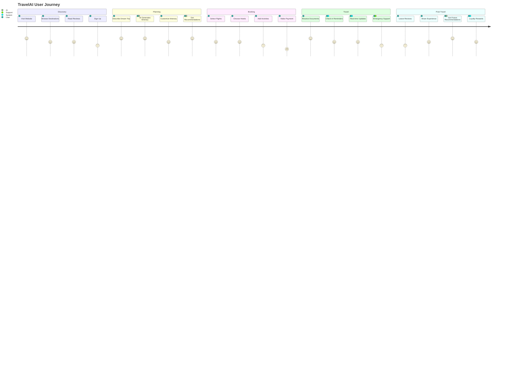
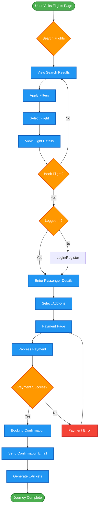
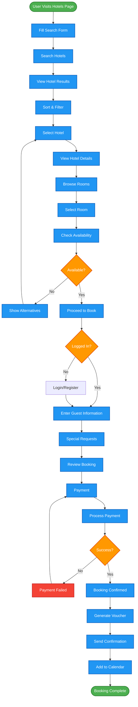
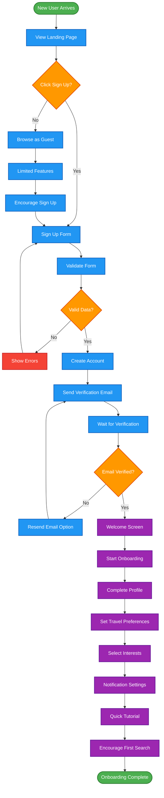
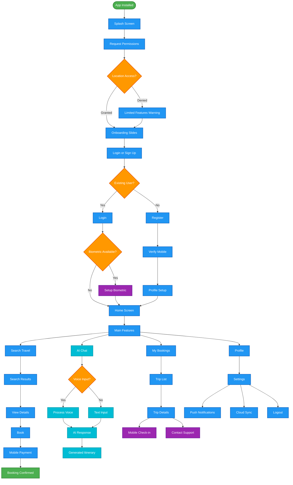

# User Journey Diagrams

## 🛤️ Complete User Journey



## 🔍 Flight Booking Journey



## 🏨 Hotel Booking Journey



## 🤖 AI Itinerary Generation Journey

```mermaid
flowchart TD
    START([User Wants AI Itinerary]) --> PROMPT[Describe Dream Trip]
    PROMPT --> PREFERENCES[Set Preferences]
    PREFERENCES --> BUDGET[Set Budget Range]
    BUDGET --> TRAVELERS[Number of Travelers]
    TRAVELERS --> DURATION[Trip Duration]
    DURATION --> INTERESTS[Select Interests]
    INTERESTS --> SUBMIT[Submit to AI]
    
    SUBMIT --> AI_PROCESS[AI Processing]
    AI_PROCESS --> GENERATE[Generate Itinerary]
    GENERATE --> REVIEW_AI[Review AI Output]
    REVIEW_AI --> SATISFIED{Satisfied?}
    
    SATISFIED -->|No| REFINE[Refine Request]
    SATISFIED -->|Yes| CUSTOMIZE[Customize Details]
    REFINE --> AI_PROCESS
    
    CUSTOMIZE --> ADD_ACTIVITIES[Add/Remove Activities]
    ADD_ACTIVITIES --> ADJUST_BUDGET[Adjust Budget]
    ADJUST_BUDGET --> SAVE_ITINERARY[Save Itinerary]
    
    SAVE_ITINERARY --> SHARE_OPTIONS{Share Itinerary?}
    SHARE_OPTIONS -->|Yes| SHARE[Share with Friends]
    SHARE_OPTIONS -->|No| BOOK_OPTIONS{Book Now?}
    SHARE --> BOOK_OPTIONS
    
    BOOK_OPTIONS -->|Yes| BOOKING_FLOW[Start Booking Process]
    BOOK_OPTIONS -->|No| SAVE_FOR_LATER[Save for Later]
    
    BOOKING_FLOW --> BOOK_FLIGHTS[Book Flights]
    BOOK_FLIGHTS --> BOOK_HOTELS[Book Hotels]
    BOOK_HOTELS --> BOOK_ACTIVITIES[Book Activities]
    BOOK_ACTIVITIES --> COMPLETE_BOOKING[Complete Booking]
    
    SAVE_FOR_LATER --> END([Itinerary Saved])
    COMPLETE_BOOKING --> END
    
    %% Styling
    classDef startEnd fill:#4CAF50,stroke:#2E7D32,stroke-width:2px,color:#fff
    classDef process fill:#2196F3,stroke:#1565C0,stroke-width:2px,color:#fff
    classDef ai fill:#FF9800,stroke:#E65100,stroke-width:2px,color:#fff
    classDef decision fill:#9C27B0,stroke:#6A1B9A,stroke-width:2px,color:#fff
    classDef booking fill:#00BCD4,stroke:#0097A7,stroke-width:2px,color:#fff
    
    class START,END startEnd
    class PROMPT,PREFERENCES,BUDGET,TRAVELERS,DURATION,INTERESTS,SUBMIT,CUSTOMIZE,ADD_ACTIVITIES,ADJUST_BUDGET,SAVE_ITINERARY,SHARE,SAVE_FOR_LATER process
    class AI_PROCESS,GENERATE,REVIEW_AI ai
    class SATISFIED,SHARE_OPTIONS,BOOK_OPTIONS decision
    class BOOKING_FLOW,BOOK_FLIGHTS,BOOK_HOTELS,BOOK_ACTIVITIES,COMPLETE_BOOKING booking
```



## 👤 User Registration & Onboarding



## 📱 Mobile App User Flow



## 🎯 Conversion Funnel

```mermaid
funnel
    title Conversion Funnel
    "Website Visitors" : 100000
    "Sign Up Started" : 15000
    "Account Created" : 12000
    "Email Verified" : 10000
    "Profile Completed" : 8500
    "First Search" : 7000
    "Viewed Results" : 6500
    "Started Booking" : 3500
    "Completed Payment" : 2800
    "Repeat Customers" : 1400
```

## 📊 User Engagement Flow

```mermaid
gitgraph
    commit id: "User Registration"
    branch onboarding
    checkout onboarding
    commit id: "Profile Setup"
    commit id: "Preferences Set"
    commit id: "First Search"
    checkout main
    merge onboarding
    commit id: "Regular Usage"
    branch booking
    checkout booking
    commit id: "First Booking"
    commit id: "Trip Completed"
    commit id: "Review Left"
    checkout main
    merge booking
    commit id: "Loyalty Member"
    branch advanced
    checkout advanced
    commit id: "AI Features Used"
    commit id: "Multiple Bookings"
    commit id: "Referral Made"
    checkout main
    merge advanced
    commit id: "Power User"
```